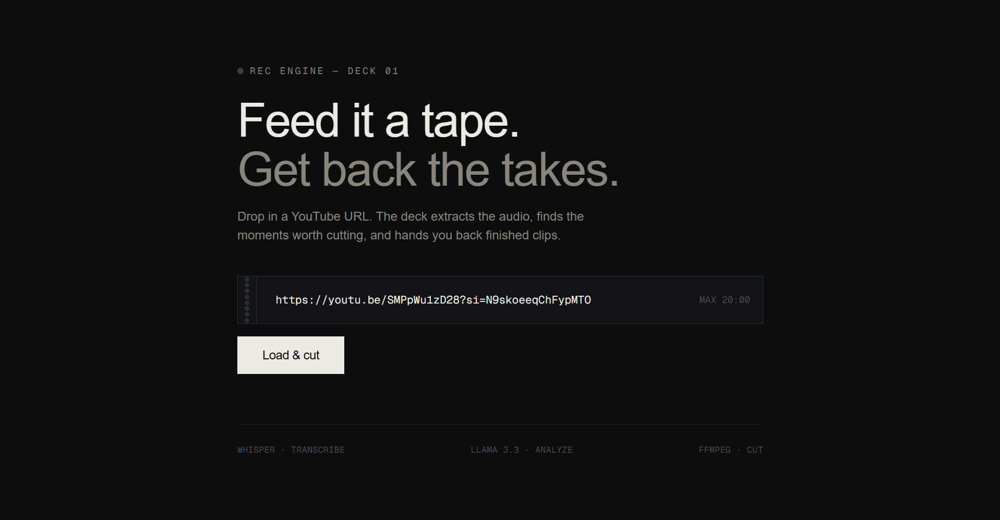
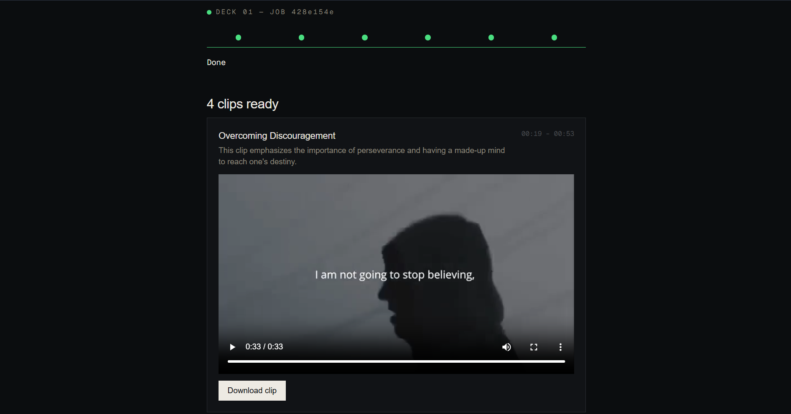

# Content Repurposing Engine

An automated pipeline that turns long-form YouTube videos into short, ready-to-post vertical clips. Drop in a URL, and the system downloads the video, transcribes it, identifies high-impact moments using an LLM, cuts the clips, and serves them back - all without touching a video editor.

**Live demo:** https://content-repurposing-engine-eight.vercel.app

---

## Screenshots

**Submitting a video**


**Completed job with playable clips**


## Why this exists

Manually slicing long-form content (podcasts, lectures, interviews) into short-form clips is time-consuming: watching hours of footage, finding hooks, cutting timeframes, reformatting. This project automates that pipeline end-to-end, built as an architectural showcase rather than a thin wrapper around a single AI API - it uses asynchronous job processing, a decoupled worker, and native media subprocessing across four independent layers.

## Architecture

The system is split into four independent layers. A Next.js frontend (Vercel) lets a user submit a YouTube URL, which hits a FastAPI gateway (Render) that immediately creates a job record in Supabase Postgres with status PENDING and returns — no video processing happens on the request thread. A separate Python worker, triggered on a 5-minute schedule via GitHub Actions, polls for the oldest pending job and processes it through five stages: downloading the video and extracting audio with yt-dlp/ffmpeg, transcribing it with word-level timestamps via Groq Whisper, identifying high-impact clip timeframes with Groq Llama 3.3, cutting the clips with ffmpeg, and uploading the results to Supabase Storage. The frontend polls the job's status throughout and renders the finished clips once the job reaches COMPLETED.

Job lifecycle: PENDING → DOWNLOADING → TRANSCRIBING → ANALYZING → CLIPPING → COMPLETED (or FAILED, with a stored error message)

## Tech stack

The frontend is built with Next.js, TypeScript, and Tailwind CSS, deployed on Vercel. The API gateway is a FastAPI service deployed on Render. Supabase provides both the Postgres database (used as the job state machine) and object storage (used to serve finished clips). The worker is a Python script using yt-dlp and ffmpeg for video/audio processing, and Groq for AI inference — Whisper for transcription and Llama 3.3 for clip selection. The worker runs on a schedule via GitHub Actions, which also handles the polling automation at zero hosting cost.

## How clip selection works

1. **Transcription:** audio is sent to Groq's Whisper API with word-level timestamps (not just segment-level) — segment boundaries from Whisper are based on pauses, not grammar, so they're often imprecise.
2. **Sentence reconstruction:** word timestamps are grouped into real sentences by detecting punctuation, giving accurate start/end boundaries to work with.
3. **Clip identification:** the timestamped transcript is sent to Llama 3.3 with a strict system prompt, constrained to return valid JSON clip timeframes (15–60 seconds each) that align exactly to real sentence boundaries.
4. **Cutting:** ffmpeg re-encodes (rather than stream-copies) each clip for frame-accurate cuts — stream-copy can only cut at keyframes, which caused clips to start/end mid-word during testing.

## Constraints

- Videos capped at 20 minutes (keeps the pipeline within GitHub Actions' free-tier compute budget and Whisper's practical upload limits)
- English-language content only (Whisper's punctuation reliability drops significantly for some other languages, which the sentence-boundary logic depends on)
- YouTube URLs only (yt-dlp supports many other platforms, but this project is scoped to YouTube for reliability)

## Local setup

```bash
# API
cd api
pip install -r requirements.txt
uvicorn main:app --reload --port 8000

# Worker
cd worker
pip install -r requirements.txt
python main.py

# Frontend
cd frontend
npm install
npm run dev
```

Each service needs its own `.env` — see `.env.example` in each folder for required variables (Supabase URL/keys, Groq API key).

## Known Limitations

YouTube cookie expiration (GitHub Actions worker only): YouTube blocks automated requests from cloud/datacenter IP ranges (including GitHub Actions runners) by default, requiring session cookie authentication to bypass bot detection. These cookies are rotated by Google as a security measure and typically expire within days, requiring periodic manual refresh via GitHub Secrets. This does not affect local execution, where requests come from a residential IP and no cookie authentication is required.

This is a platform-level anti-automation measure rather than a bug in the pipeline itself — the tradeoff was deliberately not engineered around further (e.g. via a dedicated service account or automated cookie rotation) given the scope of this project as a portfolio piece rather than a production service.

Clip quality varies by content type: works best on single-speaker, monologue-style content (interviews, lectures, talks). Multi-speaker content (podcasts, panel discussions) is harder, since the pipeline has no speaker diarization and relies on transcript text alone — it can't see visual reactions or distinguish who's speaking.

Videos are capped at 20 minutes. This keeps each job comfortably within GitHub Actions' free-tier compute budget and Whisper's practical upload limits, and keeps demo turnaround fast. Longer videos are rejected upfront with a clear error rather than failing partway through.

English-language content only. Sentence-boundary reconstruction relies on Whisper's punctuation output, which is reliable for English but inconsistent for several other languages (observed firsthand with Hindi, where Whisper often returns no punctuation at all) — scoped to English deliberately rather than building language-specific fallback logic.